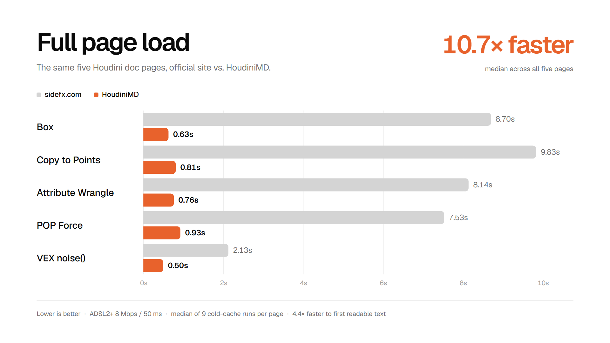
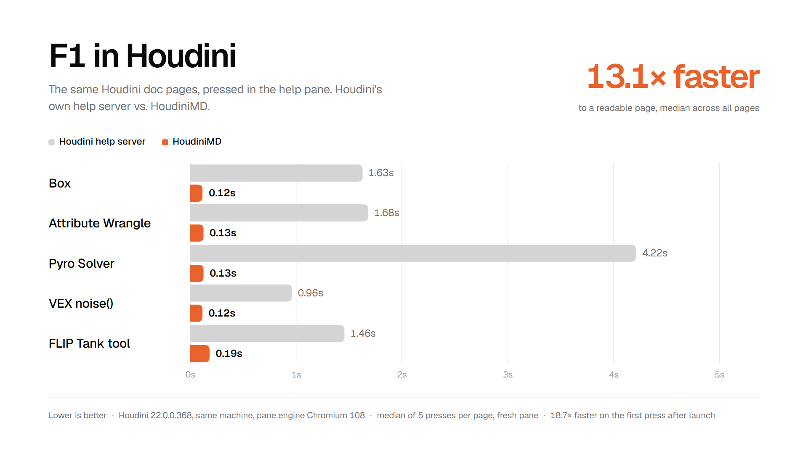

# HoudiniMD

## A blazing-fast, clutter free, clean Markdown mirror of the Houdini docs. Built for humans to read, and agents to understand.  

 

  
  
  
  

 

HoudiniMD mirrors SideFX's official Houdini documentation into clean markdown, served through a minimal, near-instant interface. Same content, displayed inside a clean and responsive interface.

It follows the [llms.txt](https://llmstxt.org) standard. AI agents are automatically redirected to raw markdown instead of scraping cluttered HTML. They get accurate, low-noise context about Houdini's nodes and functions; exactly the kind of niche knowledge even frontier models still lack.

## Features

- **Fast** — pages load instantly. <kbd>⌘K</kbd> to search, <kbd>⌘C</kbd> to copy as Markdown
- **Full Mirror, Clean Markdown** — every current and future doc page under `sidefx.com/docs` mirrored to readable markdown, dark mode included.
- **Instant search** — find any node, VEX function, or niche HOM API. You can even paste full SideFX links directly.
- **llms.txt native** — agents get raw markdown, not scraped HTML, cutting context bloat.
- **Houdini Integration** — After setting it as the default source, press <kbd>F1</kbd> to bring up HoudiniMD directly inside Houdini
- **AI Native & MCP Integration** — Paired with my [Houdini MCP](https://github.com/JTCHE/houdini-mcp) fork, agents can query pure markdown directly from HoudiniMD to inform their decisions and actions inside Houdini. Accurate info, at the right time, without context bloat.

## Install

HoudiniMD is also now available as a Desktop app, living locally, directly on your computer.

[Download for Windows](https://github.com/JTCHE/HoudiniMD/releases/latest).

The desktop app reads the docs from the Houdini build on your machine, so it works with no network. <kbd>F1</kbd> in Houdini opens the page in it.

> [!WARNING]
> Windows shows "Windows protected your PC" because the installer is not signed yet. Select **More info**, then **Run anyway**. A signature needs a legal entity, and it is on the list.

## Pricing

Free. No account, no subscription. A doc page is public and belongs to SideFX, so no doc page is ever going behind a payment. 

Paid features will come in a later update to support power-users and allow them to write custom notes on a page, sync their settings and bookmarks across machines in the cloud, and much more.

## Credits & license

Built by [John C](https://jchd.me). HoudiniMD is an unofficial, independent project and is not affiliated with or endorsed by SideFX.

**The code in this repository** is released under the [MIT License](LICENSE).

HoudiniMD is an unofficial, independent project, and isn't affiliated with or endorsed by SideFX.