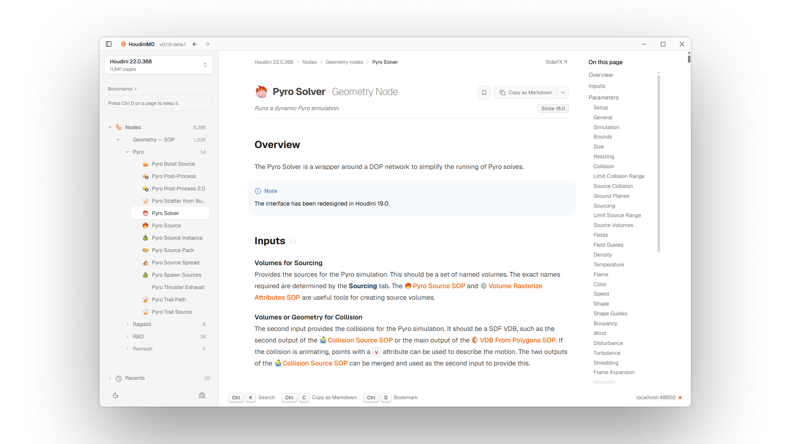

# HoudiniMD

## A blazing-fast, clutter free, clean Markdown mirror of the Houdini docs.    Built for humans to read, and agents to understand. 

  
  
  

HoudiniMD mirrors SideFX's official Houdini documentation into clean markdown, served through a minimal, near-instant interface. Same content, displayed inside a clean and responsive interface.

It follows the [llms.txt](https://llmstxt.org) standard. AI agents are automatically redirected to raw markdown instead of scraping cluttered HTML. They get accurate, low-noise context about Houdini's nodes and functions; exactly the kind of niche knowledge even frontier models still lack.

## Features

- **Fast** — pages load instantly. <kbd>⌘K</kbd> to search, <kbd>⌘C</kbd> to copy as Markdown
- **Full Mirror, Clean Markdown** — every current and future doc page under `sidefx.com/docs` mirrored to readable markdown, dark mode included.
- **Instant search** — find any node, VEX function, or niche HOM API. You can even paste full SideFX links directly.
- **llms.txt native** — agents get raw markdown, not scraped HTML, cutting context bloat.
- **Houdini Integration** — After setting it as the default source, press <kbd>F1</kbd> to bring up HoudiniMD directly inside Houdini
- **AI Native & MCP Integration** — Paired with my [Houdini MCP](https://github.com/JTCHE/houdini-mcp) fork, agents can query pure markdown directly from HoudiniMD to inform their decisions and actions inside Houdini. Accurate info, at the right time, without context bloat.

## Credits & license

Built by [John C](https://jchd.me). The documentation content is mirrored from SideFX and remains their intellectual property and © SideFX. All rights to the actual docs content belong to them. HoudiniMD is an unofficial, independent project and is not affiliated with or endorsed by SideFX.
